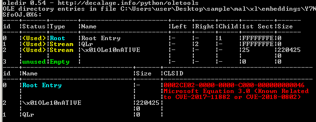
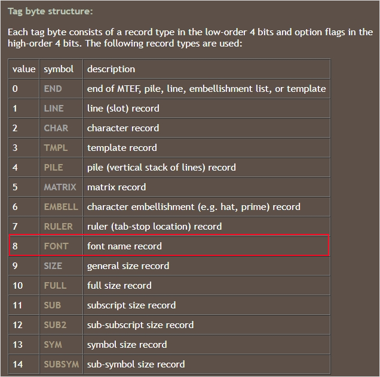
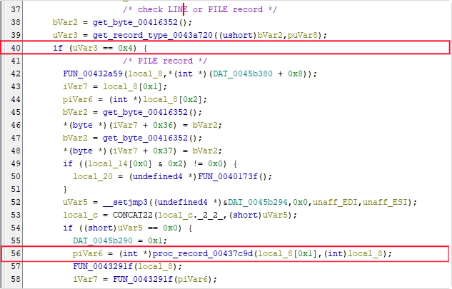
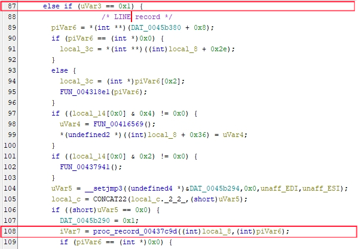
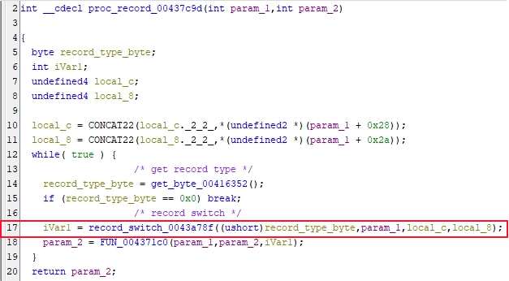
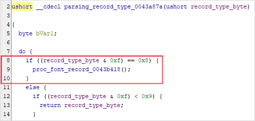
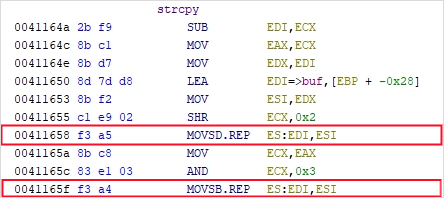
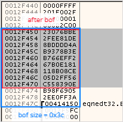
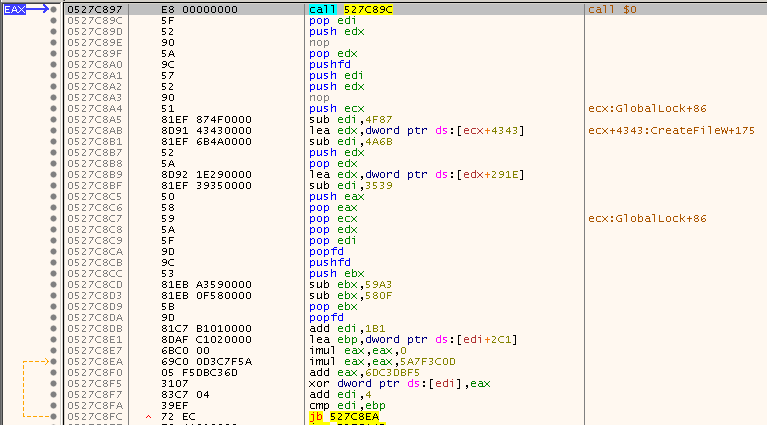

>[!info]
> 🔗 [CVE-2017-11882](https://knvd.krcert.or.kr/elkDetail.do?CVEID=CVE-2017-11882&jvn=&CVEID=CNNVD-201711-508&dilen=60c071f5dd82393915a6903d)

## CVE-2017-11882

> Microsoft Office 2007 Service Pack 3, Microsoft Office 2010 Service Pack 2, Microsoft Office 2013 Service Pack 1 및 Microsoft Office 2016을 방정식 편집기에서는 메모리에서 개체를 처리하는 방식으로 인해 발생한 원격 코드 실행을 허용하는 취약점.

> Microsoft Office Memory Corruption Vulnerability

## Summay

CVE-2017-11882 취약점은 MS 문서 파일에서 악용됨. 임베디드된 수식 객체를 처리하기 위해 EQNEDT32.exe 프로세스가 실행되고, 이 프로세스가 OLE 객체의 FONT record를 처리하는 과정에서 버퍼 오버플로우 취약점이 발생. 공격자는 이 BOF를 이용하여 반환 주소를 변경하고, EIP를 제어. 최종적으로 EIP는 MTEF 데이터가 저장되어 있는 메모리 공간으로 이동하게 되고 내부에 있는 셸코드가 실행됨.

## Analysis

### 파일내의 임베디드된 ole 파일

oledump를 활용하면 ole 파일 내의 ole 객체를 추출할 수 있음. OLe10nATIVE 객체는아래와 같이 구성됨. equation Native 객체는 4바이트 댄신 eqnolefilehdr가 위치함.

mtef 헤더에서 중요한 부분은 첫번째 이외의 바이트를 변경해도 취약점 공격에 무리가 없다는 것.

> [!info]
> 🔗 [MTEF](https://rtf2latex2e.sourceforge.net/MTEF3.html)

일반적으로 record들은 다음과 같이 구성됨. 

CVE-2017-11882의 경우 contents of PILE or LINE이 FONT일 경우, FONT 데이터를 처리하면서 bof가 취약점이 발생함.

### mtef 파싱 과정 분석

mtef 데이터는 `FUN_0043755c` 함수에서 체크되고 파싱됨. bof가 일어나는 함수로 진입하기 위해서는 `FUN_00437c9d` 함수로 진입해야 함. `FUN_00437c9d` 함수로 진입하기 위해 필요한 조건은 아래와 같음.

1. check_mtef_header 함수가 1을 반환해야 함. (mtef 헤더와 size 레코드 확인)

2. 첫 번째 레코드가 1(LINE) 또는 4(PILE) 이어야 함.

### bof 취약점이 존재하는 함수로 진입

`FUN_00437c9d` 함수로 진입했다면, contents of LINE or PILE 부분을 파싱하게 됨. 가장 먼저 contents의 record byte을 확득하여 `FUN_0043a78f`로 전달함.

전달된 record byte은 `FUN_0043a78f` 내의 `FUNC_0043a720` 내의 `FUN_0043a87a`에서 처리됨.

FONT(8) record는 FUN_0043b418에서 따로 처리됨.

해당 함수 내부의 FUN_004164fa 함수에서 font_name을 읽어들임. 여기서 사용되는 font_name의 버퍼 크기는 0x104이고 내부에 크기 체크 또한 존재하지 않음. 공격자가 작성한 BOF 데이터는 해당 함수를 통해 스텍으로 복사됨.

복사된 font_name 데이터는 FUN_004214c6 > FUN_00421774 > FUN_004115a7로 진입하면서 사용됨. 최종적으로 bof가 발생하는 FUN_0041160f로 진입함.

### bof 함수 분석

FUN_0041160f 내부에는 전달된 font_name 데이터를 복사하는 코드가 존재함. 해당 코드는 단순히 null이 등장할 때까지 font_name 데이터를 복사할 뿐, 버퍼 크기를 전혀 체크하지 않음.

앞서 mtef 데이터에서 복사한 0x3c 크기의 데이터보다 작은 0x24 크기의 데이터 밖에 담지 못함. 때문에 bof가 발생하고 ret 주소가 변경됨.

### 샘플 분석

bof가 발생한 전과 후의 stack은 다음과 같음. 0x24 크기의 버퍼에 0x3c 크기의 데이터를 복사하여 ret 주소를 덮어씀.

변경된 ret 주소는 바로 ret 명령어를 호출하게 되고, FUN_0041160f 함수의 첫 번째 인수로 전달된 복사된 font_name 데이터를 실행함.

font_name 데이터는 공격자가 설정할 수 있임. 분석 샘플의 경우, 간단한 복호화 후 GlobalUnlock 함수를 호출. 내부를 확인해보니 mtef data 였음.

그후 간단히 jmp 주소를 복호화하고 mtef 데이터가 저장되어 있는 곳 내부로 jmp 함.

해당 코드는 난독화를 복호화하는 코드로 보임.

