>[!info]
> 🔗 [CVE-2018-0798](https://knvd.krcert.or.kr/elkDetail.do?CVEID=CVE-2018-0798&jvn=&CVEID=CNNVD-201801-394&dilen=60c07c6edd82393915a857e9)

## CVE-2018-0798

> Microsoft Office 2007, Microsoft Office 2010, Microsoft Office 2013 및 Microsoft Office 2016의 방정식 편집기에서는 메모리에서 개체를 처리하는 방식으로 인해 발생한 원격 코드 실행을 허용하는 취약점.

> Microsoft Office Memory Corruption Vulnerability

## Summay

CVE-2018-0798 취약점은 MS 문서 파일에서 악용됨. 파일을 열면 EQNEDT32.exe 프로세스가 실행되고, 이 프로세스가 OLE 객체의 matrix record를 처리하는 과정에서 버퍼 오버플로우 취약점이 발생. 공격자는 이 BOF와 함수가 스택 정리를 위해 ESP를 제어한다는 점을 이용하여 반환 주소를 변경하고, EIP를 제어. 최종적으로 EIP는 스택에 존재하는 MTEF 데이터로 변경됨. MTEF 헤더의 2~5번째 바이트를 임의의 바이트로 변경 가능하다는 점을 이용해 JMP 명령어를 구성하여, MTEF 데이터 내부에 있는 셸코드로 점프할 수 있게 함.

## Analysis

### 파일내의 임베디드된 ole 파일

oledump를 활용하면 ole 파일 내의 ole 객체를 추출할 수 있음. equation Native 객체는 아래와 같이 구성됨. OLe10nATIVE 객체는 eqnolefilehdr 대신 4바이트가 위치함.

eqnolefilehdr의 가장 첫 바이트는 eqnolefilehdr의 크기를 나타냄. 그 후에 등장하는 5 바이트는 mtef header임. mtef 헤더에서 중요한 부분은 첫번째 이외의 바이트를 변경해도 취약점 공격에 무리가 없다는 것.

> [!info]
> 🔗 [MTEF](https://rtf2latex2e.sourceforge.net/MTEF3.html)

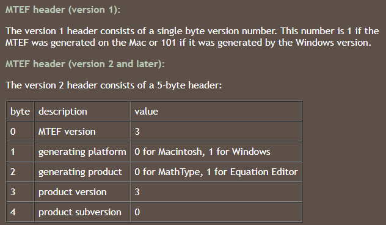

일반적으로 record들은 다음과 같이 구성됨. 

CVE-2018-0798의 경우 contents of PILE or LINE이 matrix일 경우, matrix 데이터를 처리하면서 bof가 취약점이 발생함.

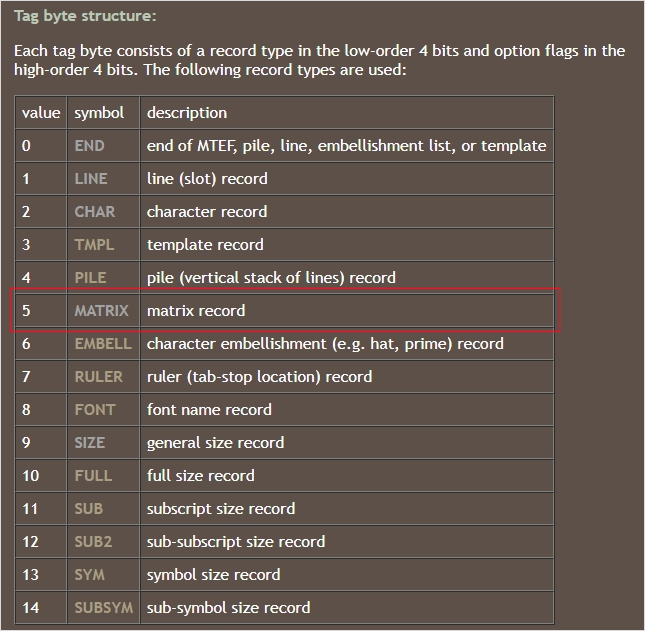

### mtef 파싱 과정 분석

mtef 데이터는 `FUN_0043755c` 함수에서 체크되고 파싱됨. bof가 일어나는 함수로 진입하기 위해서는 `FUN_00437c9d` 함수로 진입해야 함. `FUN_00437c9d` 함수로 진입하기 위해 필요한 조건은 아래와 같음.

1. check_mtef_header 함수가 1을 반환해야 함. (mtef 헤더와 size 레코드 확인)

2. 첫 번째 레코드가 1(LINE) 또는 4(PILE) 이어야 함.

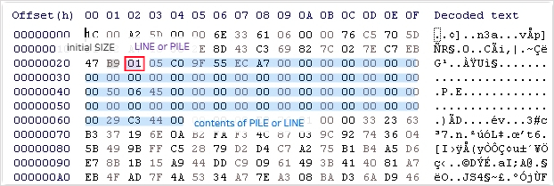

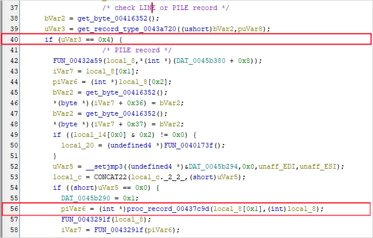

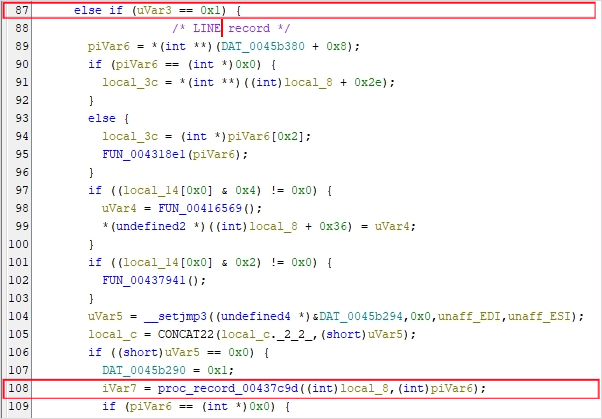

### bof 취약점이 존재하는 함수로 진입

`FUN_00437c9d` 함수로 진입했다면, contents of LINE or PILE 부분을 파싱하게 됨. 가장 먼저 contents의 record byte을 확득하여 `FUN_0043a78f`로 전달함.

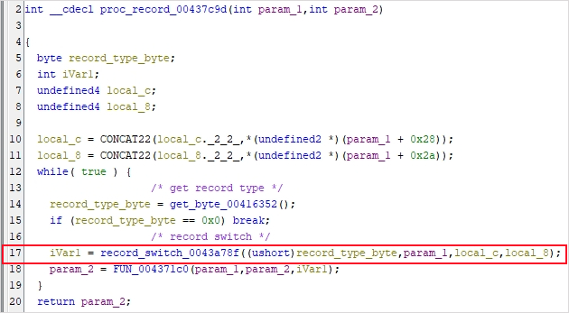

전달된 record byte은 `FUN_0043a78f` 내의 switch문에 record 데이터를 처리할 함수 테이블을 고르게 됨. MATRIX의 경우, 결과적으로 `FUN_00443e34`가 실행됨.

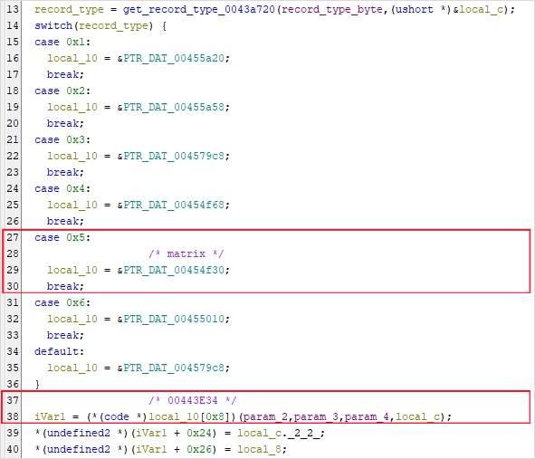

`FUN_00443e34` 함수 내에 `FUN_00443f6c`가 bof를 일으키는 함수. 

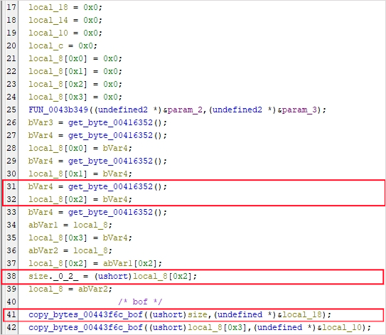

### bof 함수 분석

`FUN_00443f6c` 함수는 전달된 size만 체크할 뿐, 전달된 buf의 크기는 체크하지 않음. 때문에 전달된 buf보다 더 큰 크기의 데이터를 전달하여 bof를 일으켜 ret 주소를 변경할 수 있음. 다만 size가 그대로 사용되는 것이 아니라 `size = size * 2 + 9 >> 3` 추가 계산을 거침.

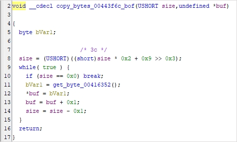

첫 번째 매개변수는 bof size를 나타내고 두번째 매개변수는 bof buf는 ret 값을 덮어쓰기위한 데이터. MATRIX 데이터에서는 다섯 번째 바이트가 bof size를 일곱 번째 바이트부터 bof buf를 나타냄.

### 샘플 분석

공격자는 0x1c 크기의 bof buf를 복사하여 ret 주소를 변경할 수 있음. 샘플에서는 0x3c 크기의 데이터가 복사되는데, 이는 총 2번의 ret 주소를 변경하기 위함.

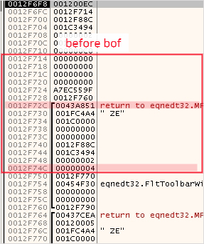

첫 번째 ret addr은 0x00450650으로 변경되고 해당 주소로 이동해보면, `add esp, 0x1c`가 존재함. 해당 명령어가 실행되면 다음 ret 주소는 0x0044c329가 됨.

0x0044c329 주소에는 `add esp, 0xcc` 명령어가 존재하는데 해당 명령어가 실행된 이후의 ret 주소는 0x001c8140임.

확인해보니 mtef 데이터가 저장되어 있던 메모리 공간임. 앞서 mtef 헤더에서 첫 번째 바이트만 중요하고 나머지는 가변적이어도 된다는 것을 이용해 세번째, 네번째 데이터를 사용하여 jmp문을 구성함. 해당 jmp를 통해 악성 shellcode로 진입.

shellcode는 다중 jmp을 통해 난독화되어 있음.

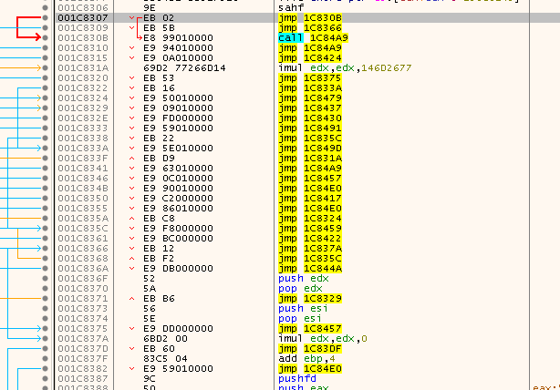

mtef 데이터가 담겨있던 마지막 ret 주소 0x001c8140가 어디서 사용되었던 값인지 확인. ret 주소를 역추적해보니 FUN_0x42F8FF 함수에서 사용됨.

ghidra를 통해 확인해보니 mtef를 파싱하는 FUN_0043755c에 전달되는 mtef 데이터였음.

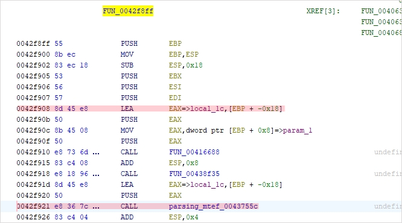

